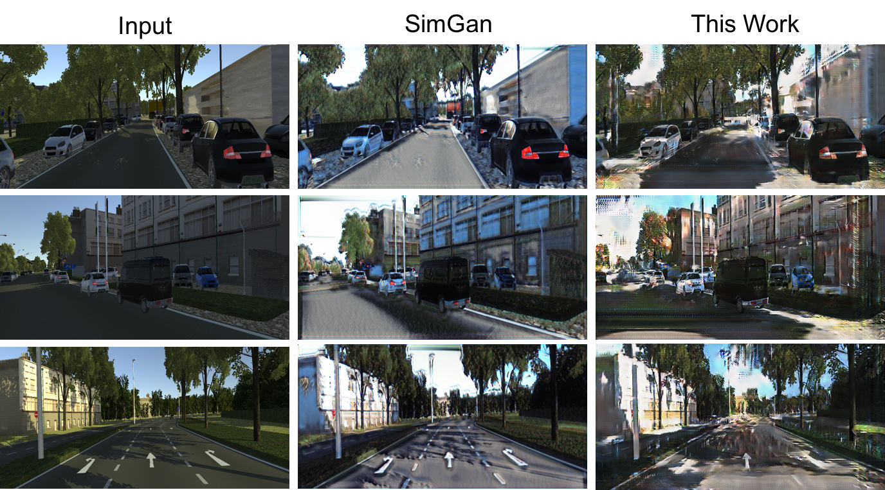

# SimGAN
## Project Description 
Title: **Make Virtual World Real**
* This project is motivated by[SimGAN](https://arxiv.org/pdf/1612.07828.pdf). 
Detail is described in the report.
* models.py includes SimGAN, CycleGAN and model from this work.

## Example Results
From left to right: virtual, refined using SimGAN, refined using model from this work.
   



## Usage
### Dataset
1. Synthetic images: [Virtual KITTI](http://www.europe.naverlabs.com/Research/Computer-Vision/Proxy-Virtual-Worlds)
2. Real images: [KITTI Object Detection](http://www.cvlibs.net/datasets/kitti/eval_object.php?obj_benchmark=2d)(left color images of object data set)

Data directory:
* Training data:  
    * virtual images under ```./datasets/road/trainA```
    * real images under ```./datasets/road/trainB```
* Validation data:  
    * virtual images under ```./datasets/road/testA```
    * real images under ```./datasets/road/testB```

### Train the model
```
python train.py --dataset=road --channel=3 --ratio=2 --lambda_=10.0
```

### Test the model
```
python test.py --dataset=road --channel=3 --ratio=2 --lambda_=10.0
```

## Acknowledgments
Code modify from [CycleGAN-Tensorflow-PyTorch-Simple](https://github.com/LynnHo/CycleGAN-Tensorflow-PyTorch-Simple) and
 [simulated-unsupervised-tensorflow](https://github.com/carpedm20/simulated-unsupervised-tensorflow).
